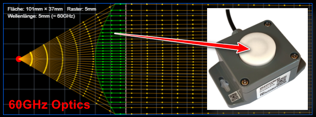
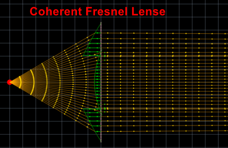

# Radaroptics Simulation 
(C) JoEmbedded.de

🚀 **[Live Demo](https://joembedded.github.io/radaroptics/)** - Direkt im Browser testen!

## Überblick
- Visualisiert Brechung und Fokussierung von mm-Wellen-Radarstrahlen in 2D.
- Simuliert die Wirkung dielektrischer Linsen mit frei definierbaren Geometrien.
- Unterstützt iterative Linsenkonstruktion durch schnelle Anpassung der Parameter in `src/main.js`.
- Liefert RealWorld Ergebnisse! Für echte, 3D-druckbare Linsen!
- Komplette Integration in FreeCAD, Linsen lassen sich (fast) komplett automatisiert erzeugen 😄👍
- Kurzes Video dazu: https://youtu.be/QgKHenz11SE

## Was ist Radaroptik?
Moderne mm-Wellen-Radarchips (z.B. ACCONEER A121) besitzen oft eine relativ breite Abstrahlkeule mit 60 bis 90 Grad. Für Punkt- oder Distanzmessungen ist eine fokussierte Keule jedoch deutlich präziser. In Bereichen um 60 GHz beträgt die Wellenlänge nur noch ca. 5 mm - groß genug, um dielektrische Linsen wie klassische Optiken zu verwenden und dennoch deutlich einfacher zu fertigen als optische Linsen, z.B. mit einem einfachen 3D-Drucker.

Die Simulation zeigt, wie sich Radarstrahlen durch verschiedene Medien bewegen. Sie betrachtet ausschließlich die Hauptstrahlablenkung und bildet keine Nebenkeulen oder Mehrwegeeffekte ab. Für den Entwurf von Linsengeometrien reicht dieser vereinfachte Ansatz in der Praxis häufig aus.

In der Praxis findet man für die üblicherweise eingesetzten Materialien ABS, PLA, PETG und für 100%-Infill (für 3D-FDM-Druck) Dielektrizitätskonstanten &epsilon;r zwischen etwa 2.5 und 3.0 ([siehe './Docus/...'](./Docus/ChatGPT_DielektrischeEigenschaftenABS_PLA_PETG_60GHz.md)). Da die Brechnung zu Luft die Wurzel &radic;(&epsilon;r) ist, sind die Designs alle ähnlich und über leichte Variationen Distanz/Radius kann man leicht das Optimum finden. Sphärische Linsen (ohne asphärische Korrekturen) lassen sich am einfachsten drucken, sind daher immer ein guter Ausgangspunkt. "Unebenheiten" der Linse, die deutlich unter der Wellenlänge liegen, sind kein Problem.

Normalerweise sind die εr für handelsübliches Material nicht bekannt. Eine grobe Messung ist möglich, indem ein Testblock des Materials in den Strahl einer Distanzmessung eingefügt wird. Dadurch misst der Sensor eine etwas größere Distanz. Diese, auf die Dicke des Testblocks bezogen, ergibt die relative Lichtgeschwindigkeit cr im Material und damit εr = (cr/c0)².
Für ein getestetes PLA-Material wurde so experimentell ein εr von ca. 2.5 bestimmt.

> [!Tip] 
> "Echtes" 100%-Infill lässt sich nie erreichen. In kleinen Hohlräumen kann sich immer noch Wasser sammeln. Gedruckte Linsen sind i.d.R. nicht wirklich für den Außeneinsatz geeignet.

Presets:
- 0: plankonvexe, hyperbolische Linse mit planer Austrittsfläche
- 1: plankonvexe, hyperbolisch/sphärische Linse mit planer Eintrittsfläche
- 2: plane, kohärente Fresnel-Linse (Achtung: flach, aber hier werden 2 Wellenzüge überlagert, evtl. also etwas weniger exakt)

## Schnellstart/Modellauswahl
1. Repository klonen oder herunterladen.
2. `index.html` in einem aktuellen Browser öffnen (lokal, kein Build-Schritt nötig).
3. In `src/main.js` die gewünschten Parameter (primär `useModel`, `waveLengthMm`) anpassen.
4. Seite im Browser neu laden, um Änderungen zu sehen.
5. Zum Exportieren der Sagitta-Werte auf das Element klicken (🔗).
6. Für FreeCAD reicht eine Seite für einen Rotationskörper, daher wird nur die positive y-Seite exportiert.
7. Datei lokal speichern (Vorschlag: 'c:/temp/stuetz.dat').
8. FreeCAD starten und Macro `radarli_freecad_import` anlegen.
9. Neues Projekt öffnen und einen Körper darin anlegen, aber noch keinen Sketch.
10. Den Macro `radarli_freecad_import` ausführen und gegebenenfalls Konturen ergänzen.
11. Sketch zum 360° Drehkörper machen.
12. Und zack: *HAPPY PRINTING* (100% Infill nicht vergessen)

## Aufbau der Simulation
- **Emitter (rot):** Punktquelle am Ursprung, deren Abstrahlwinkel über `startAngleDeg`, `endAngleDeg` und `angleStep` gesteuert wird.
- **Optische Flächen:** In `opticalSurfaces` definierte Übergänge mit fixen X-Positionen (`xFixed`) und vertikalem Ausdehnungsbereich (`yMin`, `yMax`). Jede Fläche kann plan, konvex oder konkav sein.
- **Brechung:** Die relative Dielektrizitätskonstante (`relPermittivity`) wird für den Snellius-Effekt genutzt. `focusRadius` beschreibt die Krümmung (negativ = konvex, positiv = konkav, 0 = plan).
- **Asphärizität:** Über `hyperK` kann die Fläche von sphärisch (0) hin zu paraboloid oder hyperbolisch (kleiner -1) verzerrt werden.
- **Detektorfläche:** Eine entfernte Fläche am Ende des Arrays dient als "Leinwand" für austretende Strahlen.

## Wichtige Parameter (Auszug)
| Parameter | Datei / Abschnitt | Bedeutung |
|-----------|-------------------|-----------|
| `pxPerMm` | `src/main.js` | Skalierung zwischen physikalischen Millimetern und Canvas-Pixeln. |
| `rasterMm` | `src/main.js` | Rasterabstand für das Hintergrundgitter. |
| `waveLengthMm` | `src/main.js` | Gebrauchte Radar-Wellenlänge (z.B. 5 mm bei 60 GHz). |
| `startAngleDeg`, `endAngleDeg`, `angleStep` | `drawRays()` | Öffnungswinkel und Auflösung der Abstrahlkeule. |
| `focusRadius` | `opticalSurfaces` | Krümmungsradius der Fläche; Vorzeichen bestimmt die Orientierung. |
| `relPermittivity` | `opticalSurfaces` | Relative Permittivität des Mediums hinter der Fläche. |
| `hyperK` | `opticalSurfaces` | Formfaktor für sphärische (= 0), paraboloide (< 0) oder hyperbolische Flächen (i.d.R. negativer als -1) |

## 'Radarli'-Sensor
Die Vorlage entstand für den Low-Cost-Sensor "OSX Radar Distanz 60 GHz Type 470" (aka 'Radarli'). Weitere Dokumentation und PDFs stehen unter folgendem Link bereit:

<https://joembedded.de/x3/ltx_firmware/index.php?dir=./Open-SDI12-Blue-Sensors/0470_RadarDistA>

## Anmerkungen

Es wird nur der gebeugte Wellenzug in Hauptrichtung betrachtet, keine Rückstreuung und keine Intensitätsverteilung. Die technische Berechnung/Wellenzüge sollten aber exakt den physikalischen Gesetzen entsprechen. Die ersten Ergebnisse aus dem 3D-Drucker ('Radarli') sind vielversprechend!

*Viel Erfolg beim Design eigener Radaroptiken!* 😊🎯✨
