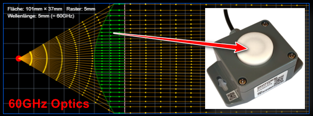

[🇩🇪 Deutsche Version](README.md) | [🇺🇸 English Version](readme_en.md)

# Radaroptics Simulation
(C) JoEmbedded.de

🚀 **[Live Demo](https://joembedded.github.io/radaroptics/)** - Try it directly in the browser!

## Overview
- Visualizes refraction and focusing of mm-wave radar beams in 2D.
- Simulates the effect of dielectric lenses with freely definable geometries.
- Supports iterative lens design by quickly adjusting parameters in `src/main.js`.
- Provides real-world results for genuine, 3D-printable lenses!
- Full integration into FreeCAD; lenses can be generated almost fully automatically 😄👍
- Short video: https://youtu.be/QgKHenz11SE

## What is radar optics?
Modern mm-wave radar chips often have a fairly wide beamwidth of 60 to 90 degrees. For point or distance measurements, however, a more strongly focused beam is preferable. At frequencies around 60 GHz the wavelength is only about 5 mm—large enough to use dielectric lenses similar to optical imaging, and at the same time easy to manufacture, for example with 3D printing.

The basic principles of wave optics apply to mm waves:
- **Huygens' principle** – describes the propagation of wavefronts
- **Fermat's principle** – describes the ray path as the route of minimal optical length
- **Snell's law** – describes refraction and reflection at the boundary of materials with different dielectric or optical properties

The simulation shows how radar beams move through different media. It only considers the main beam deflection and does not model sidelobes or multipath effects. For designing lens geometries, this simplified approach is often sufficient in practice.

> [!Note]
> The simulation shows only vectors. Because the radar wavelength is relatively large compared to the geometric dimensions, this results in some blur in reality. The following constraints arise from this:
> - Realistic aperture angles of simple, "small" radar optics (e.g., 30 mm) are in the range of about 10–15° at minimum.
> - Due to these limited aperture angles, the small offset between RX and TX antennas often found on radar chips is negligible.
> - The antennas on radar chips are typically matched to air as the dielectric. An additional dielectric antenna (e.g., a radar lens) can disturb this matching, so in practice a spacing of about two wavelengths or more is advisable.

For the commonly used materials ABS, PLA, and PETG with 100% infill (for 3D FDM printing), relative permittivities $ε_r$ between roughly 2.5 and 3.0 are typical ([see './Docus/...'](./Docus/ChatGPT_DielektrischeEigenschaftenABS_PLA_PETG_60GHz.md)). Because refraction to air is determined by the square root $\sqrt{ε_r}$, the designs are all similar and the optimum can be found easily by slightly varying distance/radius. Spherical lenses (without aspherical corrections) are easiest to print and therefore always a good starting point. "Unevenness" of the lens that is well below the wavelength is not an issue.

Normally the $ε_r$ for commercially available material is not known. A rough measurement is possible by placing a test block of the material into the beam of a distance measurement. The sensor then measures a slightly greater distance. Relating this to the thickness of the test block yields the relative speed of light $c_r$ in the material and thus $ε_r = (c_r / c_0)^2$. For one tested PLA material, an $ε_r$ of about 2.5 was determined experimentally.

> [!Important]
> Truly 100% infill is never achievable. Water can still accumulate in small cavities. Printed lenses are therefore generally not really suitable for outdoor use.

Presets for types:
- '0': Plano-convex, hyperbolic lens with a planar exit surface
- '1': Plano-convex, (a-/)spherical lens with a planar entry surface
- '2': Planar, coherent Fresnel lens

> [!Tip]
> - **Type '0'** (with planar exit surface) reaches ideal aspheric correction with the parameters (per DIN ISO 10110-12):
> $f_{sag}( y ) = \frac{ y^2 }{ focusRadius + \sqrt{focusRadius^2 - (1 + k) C^2 y^2}}$  
> for (as in the Type '0' example): 
> $focusRadius = X_{fixed} * (\sqrt{ε_r} - 1)$ and  $hyperK = -ε_r$ 
> the optimum is: 
> $X_{fixed} = 10 mm$ and $ε_r = 2.5$ : $focusRadius = 5.8 mm$ and $hyperK = -2.5$
>
> - **Type '1'** (with planar entry surface) is already easy to print as a purely spherical lens with sufficiently good results for initial tests. In practice, the aspheric correction then provides noticeably better performance for lenses with smaller diameters.
>
> - **Type '2'** (coherent Fresnel lens) is indeed nice and flat, but beware: two or more wave trains are superimposed here, which may make it slightly less accurate.

## A real-world result

A real Type '0' lens with excellent performance:
- Manufactured by CNC from solid ABS material, making it fully outdoor-suitable
- Slight modifications compared to 3D printing:
    - Focus is shifted by +1mm for adjustment.
    - Transition at the inner corner was rounded with a 2mm radius for easier manufacturing.

> [!IMPORTANT]
> 📧⚙️🛠️ Inquiries for technical collaborations are always welcome!

## Quick start / model selection
1. Either run online or clone/download the repo (to design your own lenses adjust the desired parameters in `src/main.js`, primarily `useModel`, `waveLengthMm`).
2. To export the sagitta values, click on the element (🔗).
3. For FreeCAD, one side is sufficient for a body of revolution, so only the positive y-side is exported.
4. Save the file locally (suggestion: 'c:/temp/stuetz.dat').
5. Start FreeCAD and create the macro `radarli_freecad_import`.
6. Open a new project and create a body in it, but do not add a sketch yet.
7. Run the macro `radarli_freecad_import` and add contours if necessary.
8. Turn the sketch into a 360° rotational body.
9. And boom: *HAPPY PRINTING* (don't forget 100% infill)

## Simulation structure
- **Emitter (red):** Point source at the origin whose beam angle is controlled via `startAngleDeg`, `endAngleDeg`, and `angleStep`.
- **Optical surfaces:** Transitions defined in `opticalSurfaces` (in `src/main.js`) with fixed X positions (`xFixed`) and vertical extent (`yMin`, `yMax`). Each surface can be planar, convex, or concave.
- **Refraction:** The relative permittivity (`relPermittivity`) is used for the Snellius effect. `focusRadius` describes the curvature (negative = convex, positive = concave, 0 = planar).
- **Asphericity:** The surface can be distorted from spherical (0) toward paraboloid or hyperbolic (less than -1) via `hyperK` ('conic constant').

## Key parameters (excerpt)
| Parameter | File / Section | Meaning |
|-----------|----------------|---------|
| `pxPerMm` | `src/main.js` | Scaling between physical millimeters and canvas pixels. |
| `rasterMm` | `src/main.js` | Grid spacing for the background grid. |
| `waveLengthMm` | `src/main.js` | Radar wavelength used (e.g., 5 mm at 60 GHz). |
| `startAngleDeg`, `endAngleDeg`, `angleStep` | `drawRays()` | Beam opening angle and resolution. |
| `focusRadius` | `opticalSurfaces` | Radius of curvature of the surface; the sign determines the orientation. |
| `relPermittivity` | `opticalSurfaces` | Relative permittivity of the medium behind the surface. |
| `hyperK` | `opticalSurfaces` | The 'conic constant' for spherical (= 0), paraboloid (< 0), or hyperbolic surfaces (usually more negative than -1) |

## 'Radarli' sensor
The template was created for the low-cost sensor "OSX Radar Distance 60 GHz Type 470" (aka 'Radarli'). Additional documentation and PDFs are available at the following link:

<https://joembedded.de/x3/ltx_firmware/index.php?dir=./Open-SDI12-Blue-Sensors/0470_RadarDistA>

## Notes about the Simulation

Only the refracted wave train in the main direction is considered, not backscatter or intensity distribution. However, the calculation exactly follows the physical laws. The first results ('Radarli') are promising and agree very well with the expected values.

*Good luck designing your own radar optics!* 😊🎯✨
 *And, as already mentioned:* 📧⚙️🛠️ *Inquiries for technical collaborations are always welcome!*
